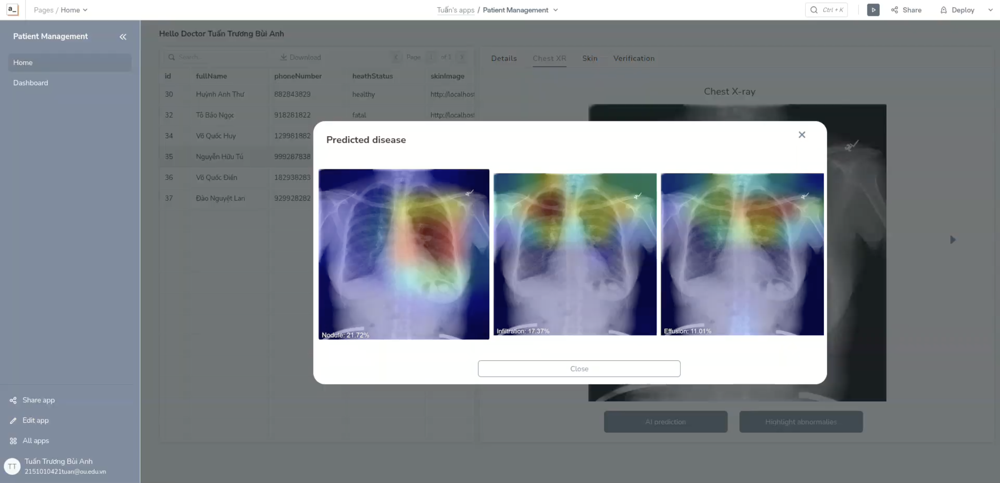
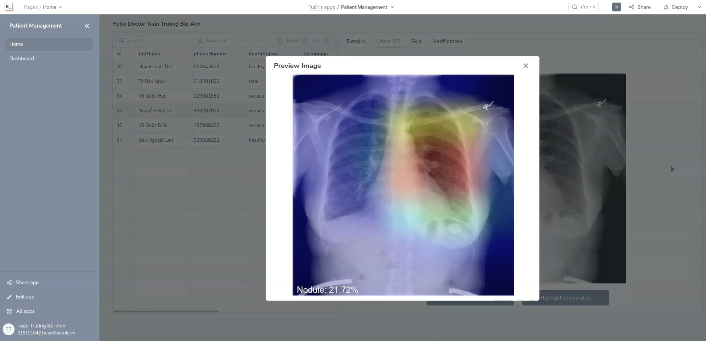
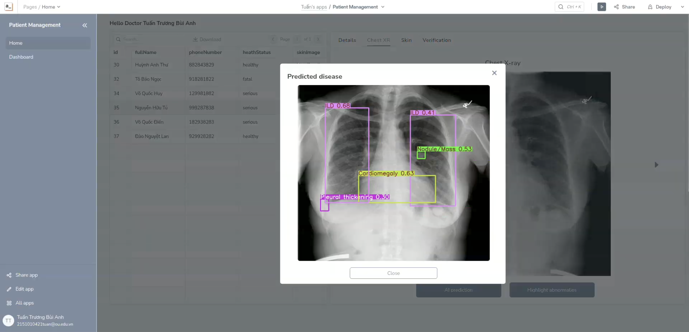
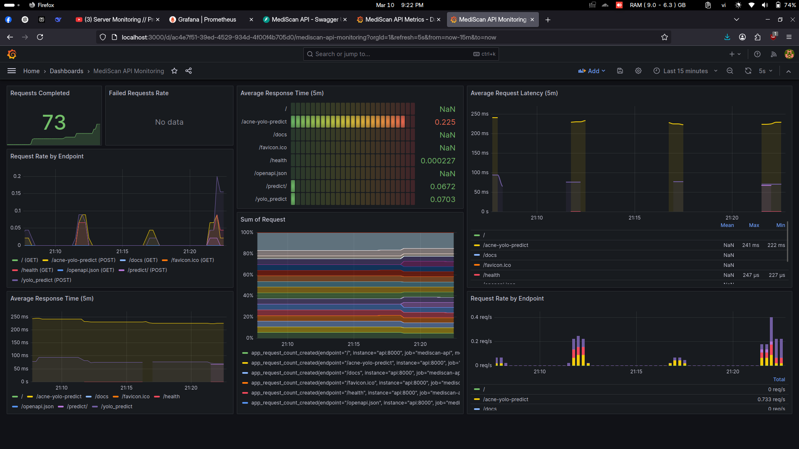
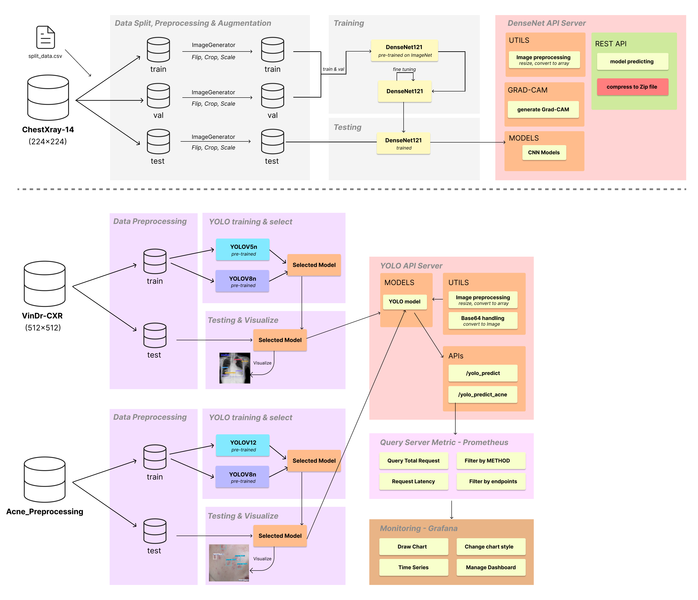
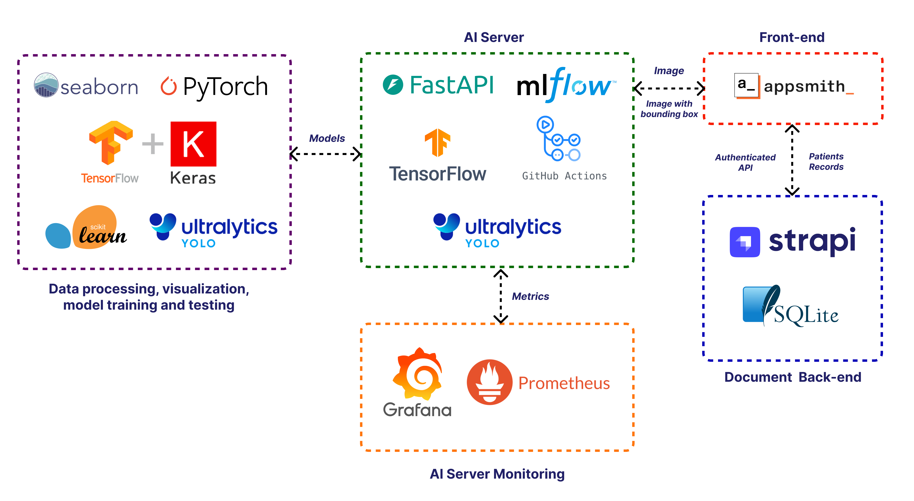
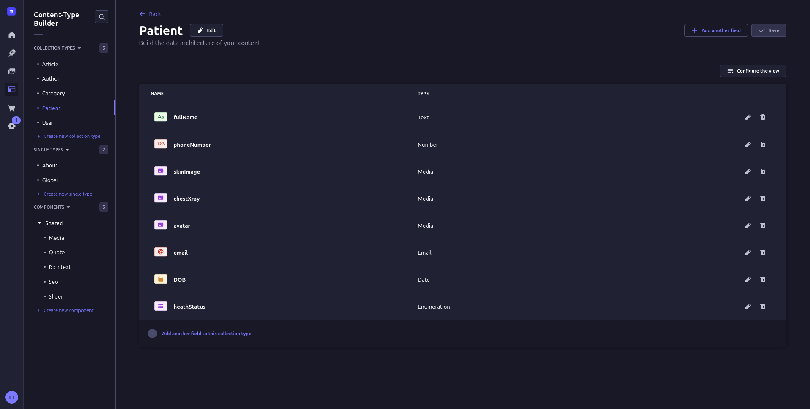

# MediScan

> Advanced Medical Image Analysis Platform powered by YOLO and DenseNet121 models
<div >
  <a href="https://www.tensorflow.org/"></a>
  <a href="https://fastapi.tiangolo.com/"></a>
  <a href="https://www.appsmith.com/"></a>
  <a href="https://strapi.io/"></a>
  <a href="https://www.docker.com/"></a>
  <a href="https://grafana.com/"></a>
    <a href="https://ultralytics.com/yolov8"></a>
</div>

## Table of Contents
- [Core Features](#core-features)
- [Application UI Demo](#application-ui-demo)
  - [System Dashboard](#system-dashboard)
  - [Medical Analysis Interface](#medical-analysis-interface)
- [System Overview](#system-overview)
  - [System Flow Architecture](#system-flow-architecture)
  - [Technology Stack](#technology-stack)
  - [Content Management System](#content-management-system)
- [System Architecture](#system-architecture)
- [Development Setup](#development-setup)
- [API Reference](#api-reference)
- [Configuration](#configuration)
- [Monitoring](#monitoring)
- [Contributing](#contributing)
- [License](#license)

## Core Features

- 🔍 **Advanced Image Analysis**
  - Chest X-ray abnormality detection
  - Skin condition assessment
  - Multi-model support
  
- ⚡ **Performance**
  - Real-time image processing
  - Optimized YOLO implementations
  - Scalable architecture

- 🛠 **Technical Capabilities**
  - RESTful API architecture
  - Comprehensive metrics monitoring

## Application UI Demo


### Medical Analysis Interface
<div style="display: grid; grid-template-columns: repeat(2, 1fr); gap: 20px; margin: 20px 0;">
    
    
    
    
</div>

### System Dashboard
<div style="margin: 20px 0;">
    
</div>

## System Overview

### System Flow Architecture

*End-to-end system architecture and data flow*

### Technology Stack

*Complete technology stack overview*

#### Tech Stack Breakdown

- **Data Processing & ML** 🧮
  - TensorFlow, PyTorch, scikit-learn, YOLO
  - Purpose: Model training and data preprocessing

- **AI Server** 🤖
  - FastAPI, MLflow, DenseNet, YOLO
  - Purpose: Model serving and experiment tracking

- **Frontend** 🎨
  - Appsmith
  - Purpose: Medical imaging interface

- **Backend** 📁
  - Strapi CMS, SQLite
  - Purpose: Patient data management

- **Monitoring** 📊
  - Grafana, Prometheus
  - Purpose: System metrics and analytics

---

### Content Management System

*Strapi CMS interface for content management*

## System Architecture

```ascii
mediscan/
├── .github/                    # GitHub-related configurations (CI/CD, issues, PRs)
├── assets/                     # Static assets (e.g., images, icons, documentation)
│
├── be-fastapi/                 # Core Analysis Engine
│   ├── main.py                 # Application entrypoint
│   ├── utils/                   # Core utilities
│   │   ├── models.py            # Model management & YOLO implementations
│   │   ├── image_processing.py  # Image preprocessing & augmentation
│   │   └── metrics.py           # Performance & inference metrics
│   ├── tests/                   # Test suites
│   │   ├── unit/                # Unit tests
│   │   └── integration/         # Integration tests
│   ├── models/                  # Pre-trained model storage
│   │   ├── xray/                # X-ray analysis models
│   │   └── skin/                # Skin condition models
│   └── requirements.txt         # Python dependencies
│
├── be-fastapi-densenet/        # DenseNet Model Service
│   ├── main.py                 # DenseNet application entry
│   ├── models/                 # DenseNet model files
│   │   └── DenseNet121_epoch_30.keras
│   ├── services/               # Service Layer
│   │   ├── __init__.py
│   │   └── image_service.py
│   ├── utils/                  # DenseNet utilities
│   │   ├── __init__.py
│   │   ├── gradcam.py          # Grad-CAM visualization
│   ├── .dockerignore
│   ├── .gitignore
│   ├── config.py
│   ├── docker-compose.yml
│   ├── Dockerfile
│   ├── requirements.txt        # DenseNet dependencies
│   ├── schemas.py              # API schemas
│
├── be-strapi/                  # Content Management System
│   ├── api/                    # API definitions & routes
│   ├── config/                 # CMS configurations
│   ├── scripts/                # Utility scripts
│   │   ├── seed.js             # Database seeding
│   │   └── backup.js           # Backup utilities
│   ├── data/                   # CMS data and content
│   │   ├── uploads/            # Media storage
│   │   └── exports/            # Data exports
│   └── package.json            # Node.js dependencies
│
├── dataset/                    # Dataset storage and preprocessing
│
├── fe-appsmith/                # Frontend Appsmith integration
│   └── PatientManagementApp.json  # Appsmith configurations
│
├── grafana/                    # Analytics & Monitoring
│   ├── dashboards/             # Custom dashboard definitions
│   │   ├── system.json         # System metrics dashboard
│   │   └── model.json          # Model performance dashboard
│   └── provisioning/           # Grafana configurations
│       ├── datasources/        # Data source configs
│       └── notifications/      # Alert configurations
│
├── notebooks/                  # Jupyter notebooks for experimentation
│
├── prometheus/                 # Monitoring metrics collection
│   └── prometheus.yaml         # Prometheus data source configurations
├── .gitattributes
├── CODE_OF_CONDUCT.md          # Code of conduct guidelines
├── docker-compose.yml          # Docker orchestration
├── LICENSE                     # Open-source license
└── README.md                   # Project documentation

```

## Development Setup

### Requirements

- Python 3.8+
- Node.js 18+
- Docker & Docker Compose
- GPU support (recommended)

### Quick Start

1. **Environment Setup**
   ```bash
   git clone https://github.com/your-org/mediscan.git
   cd mediscan
   ```

2. **Backend & Monitoring services**
   ```bash
   # FastAPI Backend
   cd be-fastapi
   python -m venv venv
   source venv/bin/activate  # Windows: venv\Scripts\Activate.ps1
   pip install -r requirements.txt
   
   # Start API Server
   uvicorn main:app --reload --port 8000

   # FastAPI Backend for DenseNet121
   cd be-fastapi-densenet
   python -m venv venv
   source venv/bin/activate  # Windows: venv\Scripts\Activate.ps1
   pip install -r requirements.txt
   
   # Start API Server
   uvicorn main:app --reload --port 5000
   ```
   OR with Docker Compose:
   ```bash
   docker-compose up -d
   ```

3. **CMS**
   ```bash
   # Strapi CMS
   cd be-strapi
   npm install
   npm run develop
   ```

## API Reference

### Core Endpoints

| Endpoint | Method | Description |
|----------|--------|-------------|
| `/predict` | POST | Generic prediction pipeline |
| `/yolo_predict` | POST | X-ray analysis |
| `/acne-yolo-predict` | POST | Skin condition analysis |
| `/metrics` | GET | System metrics |
| `/health` | GET | Service health |

## Configuration

### Environment Variables

| Variable | Description | Default |
|----------|-------------|---------|
| `CORS_ORIGINS` | Allowed origins | `*` |
| `MODEL_PATH` | Model directory | `./models` |
| `PORT` | Service port | `8000` |

## Monitoring

- Real-time performance metrics
- Model inference tracking
- System resource monitoring
- Custom Grafana dashboards

## Contributing

1. Fork the repository
2. Create a feature branch (`git checkout -b feature/enhancement`)
3. Commit changes (`git commit -am 'Add enhancement'`)
4. Push branch (`git push origin feature/enhancement`)
5. Open a Pull Request


## License

MIT License - See [LICENSE](LICENSE) for details